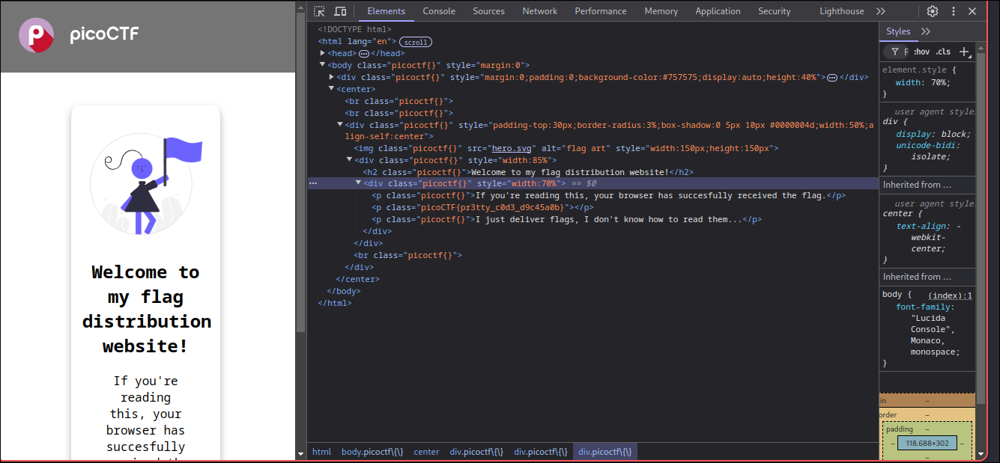

## let's start
First, you need to open the web development tools by right-clicking on the page and selecting "Inspect" from the menu.

You will see this:

Now, look around in the source code, and you will find the flag.

Flag: picoCTF{pr3tty_c0d3_d9c45a0b}