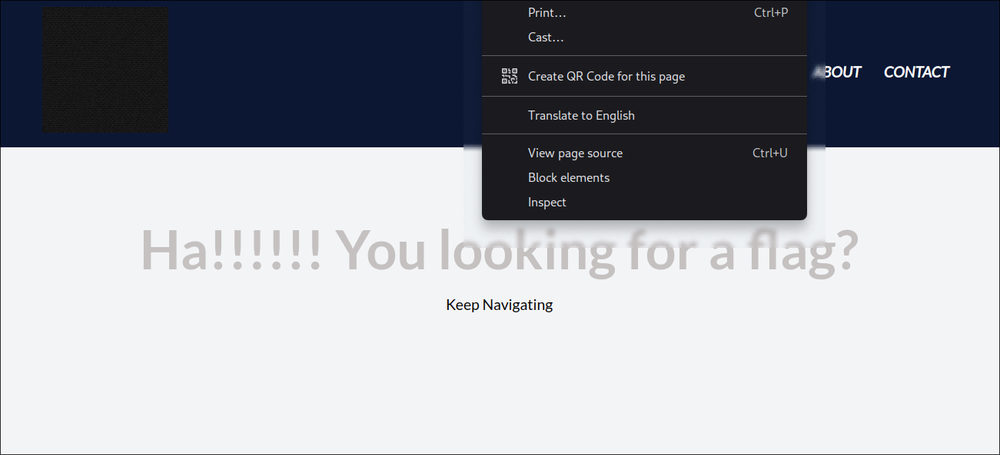
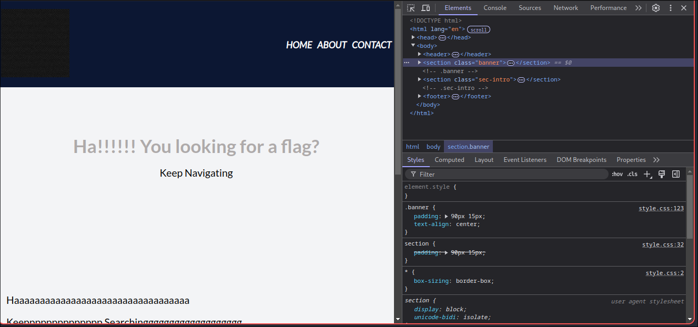
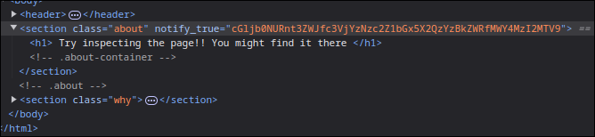

### open web inspector
bBy right-clicking on your mouse, you can choose Inspect from the menu.


Then, you will see something like this:


The Web Inspector is a web development tool built into web browsers that helps developers inspect, tweak, debug, and analyze the performance of their web content.

Now, you need to navigate through the source code of each web page, searching for our flag.

The flag is found on the About page:


This is our flag `cGljb0NURnt3ZWJfc3VjYzNzc2Z1bGx5X2QzYzBkZWRfMWY4MzI2MTV9` However, it is Base64-encoded, so we need to decode it. You can use online tools to decode it, but we'll use Python instead.

``` python

import base64

flagEncoded = "cGljb0NURnt3ZWJfc3VjYzNzc2Z1bGx5X2QzYzBkZWRfMWY4MzI2MTV9"

flag = base64.b64decode(flagEncoded).decode()

print(flag)

```
The output is: `picoCTF{web_succ3ssfully_d3c0ded_1f832615}`


